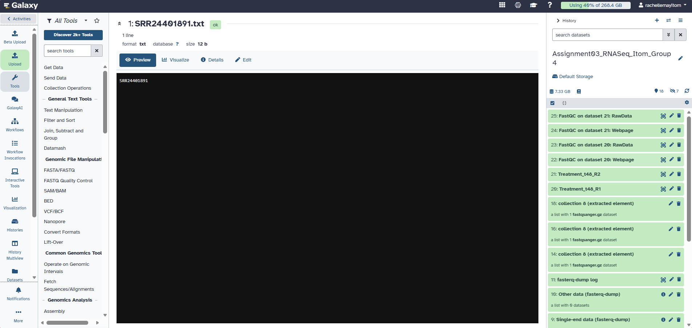
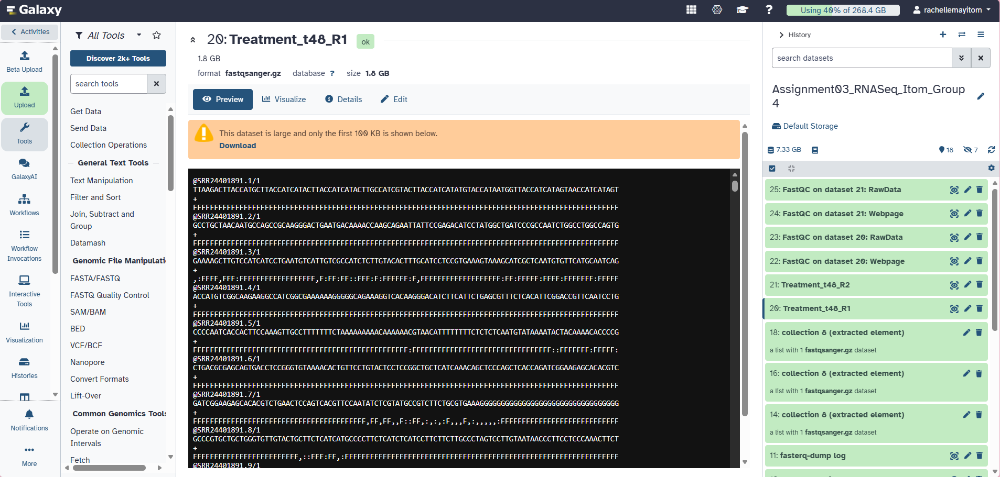
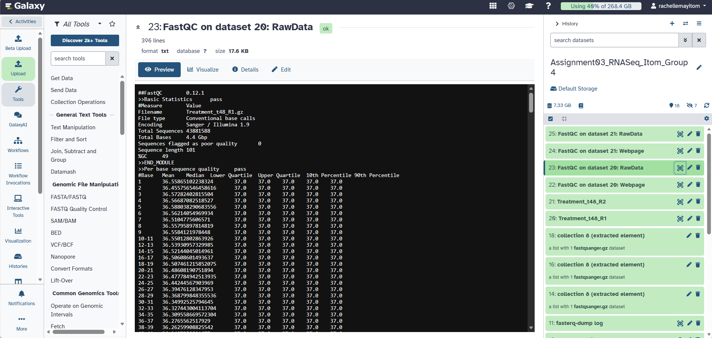

# Assignment 3: RNA-Seq Familiarization

**Student:** Rachelle May A. Itom  
**Group:** Group 4

## Assigned RNA-seq Dataset

**RNA-seq Run Accession:** SRR24401891

**Condition:** Treatment — salt stress, 48 h (t48), Replicate 1

**Sequencing Type:** Paired-end

**Number of Reads:**
- R1: 43,881,588
- R2: 43,881,588

**Read Length:**
- R1: 101 bp
- R2: 101 bp

**GC Content:**
- R1: 49%
- R2: 49%

  ## FastQC Results

**File Size:**
- R1: 1.8 GB
- R2: 1.9 GB

**General Per-Base Sequence Quality:**
- R1: Pass
- R2: Pass

**Adapter Content:**
- R1: Pass
- R2: Warn

**Overrepresented Sequences:**
- R1: Warn
- R2: Fail

**Other QC Observations:**
- R1: Per-base sequence content (Warn), Sequence Duplication Levels (Fail)
- R2: Per-base sequence content (Fail), Per-sequence GC content (Fail), Sequence Duplication Levels (Fail)

## Biological Meaning of the Sample

This sample represents *Chara braunii* exposed to salt stress at 5 PSU for 48 hours. It is one biological replicate from the treatment group. Subsurface thalli segments were used for RNA extraction and RNA sequencing to examine changes in the transcriptome in response to salinity stress.

## Interpretation

The RNA-seq dataset is paired-end with 101 bp reads and contains 43,881,588 reads for both R1 and R2. The general per-base sequence quality passed for both reads, indicating good overall base quality. However, some quality concerns were observed, including sequence duplication, per-base sequence content, and overrepresented sequences. R2 also showed warnings or failures for GC content and adapter content. These results should be considered when evaluating the quality of the RNA-seq dataset.

## Conclusion

The assigned RNA-seq sample provides a high number of 101 bp paired-end reads from *Chara braunii* under 48-hour salt stress. FastQC showed good general base quality, although several QC parameters indicated potential sequence composition and duplication issues. The dataset can therefore be characterized using the FastQC results before proceeding to downstream RNA-seq analysis.

## Screenshots

### Galaxy RNA-seq Dataset

### FASTQ Preview

### FastQC Basic Statistics

